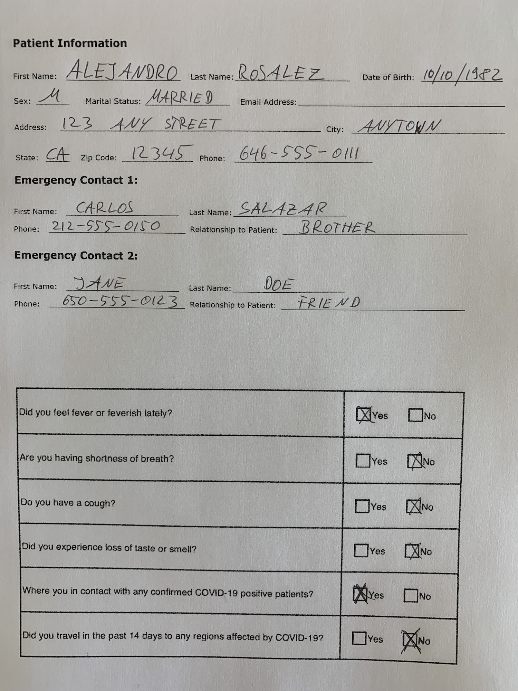

# Extract Information By Using Document Geometry + Amazon Textract

This is a repo showing a quick start to taking advantage of the geometric context found in a document to make tagging easier and more accurate with Amazon Textract. We are going to be using SageMaker StudioLab as our dev environment and the [Textractor](https://github.com/aws-samples/amazon-textract-textractor) Python library by Martin Schade.

## What does it do?

It takes the output from the `AnalyzeText` Forms API and, combined with the `XY` coordinates from the key/values detected, it allows you to tag these pairs into groups for convenience, e.g. all "Patient" KV pairs.

| Key                                  | Value          |
|--------------------------------------|----------------|
| PATIENT_first name:                  | ALEJANDRO      |
| PATIENT_address:                     | 123 ANY STREET |
| PATIENT_sex:                         | M              |
| PATIENT_state:                       | CA             |
| PATIENT_zip code:                    | 12345          |
| PATIENT_marital status:              | MARRIED        |
| PATIENT_last name:                   | ROSALEZ        |
| PATIENT_phone:                       | 646-555-0111   |
| PATIENT_email address:               |                |
| PATIENT_city:                        | ANYTOWN        |
| PATIENT_date of birth:               | 10/10/1982     |
| EMERGENCY_1_first name:              | CARLOS         |
| EMERGENCY_1_phone:                   | 212-555-0150   |
| EMERGENCY_1_relationship to patient: | BROTHER        |
| EMERGENCY_1_last name:               | SALAZAR        |
| EMERGENCY_2_first name:              | JANE           |
| EMERGENCY_2_phone:                   | 650-555-0123   |
| EMERGENCY_2_last name:               | DOE            |
| EMERGENCY_2_relationship to patient: | FRIEND         |
| FEVER->YES                           | SELECTED       |
| FEVER->NO                            | NOT_SELECTED   |
| SHORTNESS->YES                       | NOT_SELECTED   |
| SHORTNESS->NO                        | SELECTED       |
| COUGH->YES                           | NOT_SELECTED   |
| COUGH->NO                            | SELECTED       |
| LOSS_OF_TASTE->YES                   | NOT_SELECTED   |
| LOSS_OF_TASTE->NO                    | SELECTED       |
| COVID_CONTACT->YES                   | SELECTED       |
| COVID_CONTACT->NO                    | NOT_SELECTED   |
| TRAVEL->YES                          | NOT_SELECTED   |
| TRAVEL->NO                           | SELECTED       |

## How to run

Click here to open this Notebook in StudioLab  and follow the instructions that will appear on the screen to clone the repo and create your Conda environment with all the dependencies you will need to run this.

## References

- [Access AWS resources from Studiolab](https://github.com/aws/studio-lab-examples/blob/main/connect-to-aws/Access_AWS_from_Studio_Lab.ipynb)
- [Textractor GeoFinder Sample Notebook](https://github.com/aws-samples/amazon-textract-textractor/blob/master/tpipelinegeofinder/geofinder-sample-notebook.ipynb)
